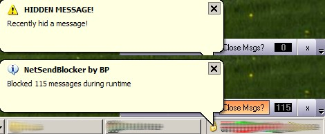

<div align="center">

## NetSendBlocker \- Hide\!


</div>

### Description

Who does like this? Someone is sending you a lot of netsends but either you cannot disable the windowsserver or you dont want it to.

This small tool has two options:

1. it hides the first net send, so no net send window will appear again. one click on "show" and it appears again.

2. it closes all incoming net send windows and count them for a statistic result

obviously, it can be disabled, too!

the small toolbar dock always next to the taskbar and have a nice office xp look
 
### More Info
 
you need to set a variable in the code to the titlename of your netsend window.

in the archiv it is set to the germanname.

maybe you need to put a blank space after it, works here with one only.


<span>             |<span>
---                |---
**Submitted On**   |2005-11-23 09:32:56
**By**             |[Benjamin Philipp](https://github.com/Planet-Source-Code/PSCIndex/blob/master/ByAuthor/benjamin-philipp.md)
**Level**          |Beginner
**User Rating**    |4.0 (8 globes from 2 users)
**Compatibility**  |VB 6\.0
**Category**       |[Complete Applications](https://github.com/Planet-Source-Code/PSCIndex/blob/master/ByCategory/complete-applications__1-27.md)
**World**          |[Visual Basic](https://github.com/Planet-Source-Code/PSCIndex/blob/master/ByWorld/visual-basic.md)
**Archive File**   |[NetSendBlo19566212152005\.zip](https://github.com/Planet-Source-Code/benjamin-philipp-netsendblocker-hide__1-63654/archive/master.zip)

### API Declarations

```
Private Declare Function SendMessageByString Lib "user32" Alias "SendMessageA" (ByVal hWnd As Long, ByVal wMsg As Long, ByVal wParam As Long, ByVal lParam As String) As Long
Private Declare Function SendMessage Lib "user32" Alias "SendMessageA" (ByVal hWnd As Long, ByVal wMsg As Long, ByVal wParam As Integer, ByVal lParam As Long) As Long
Private Declare Function FindWindow Lib "user32" Alias "FindWindowA" (ByVal lpClassName As String, ByVal lpWindowName As String) As Long
Private Declare Function ShowWindow Lib "user32" (ByVal hWnd As Long, ByVal nCmdShow As Long) As Long
Private Declare Function GetWindowRect Lib "user32" (ByVal hWnd As Long, lpRect As RECT) As Long
```


